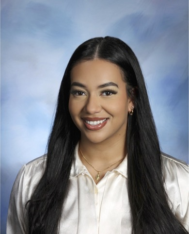

## Bio

Carolyn Martinez (she/her) is a second year MPH student at the Mailman School of Public Health. She immigrated from the Dominican Republic with her family and has lived in New York City all of her life. Growing up in the South Bronx and East Harlem gave her a first hand account of the severe health disparities in the United States, which ignited her passion for public health. She is currently an intern at the New York City Health Department supporting data quality improvement and analysis in the Children, Youth, and Families Bureau. After graduation, she hopes to pursue opportunities that allow her to combine her passion for health disparities and storytelling through data analytics to improve population health. 